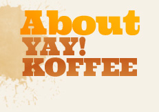

<head>
	<meta charset="UTF-8">
	<title>About Ben's caffeine Break</title>
    <link rel="stylesheet" type="text/css" media="all" href="css/style.css" />
</head>

	
*   [Home](index)
*   [Menu](menu)
*   [Locations](locations)
*   [About Us](about)

 

Caffeine for when you need to do homework hungover.

	
### Sometimes dealines sneak up on you
Or sometimes the professor flips the date on the site.
### Sometimes the assignment felt too easy
You need caffeine to rethink it.
### Sometimes the assignment is too hard
Who we kidding? You just want caffeine.
	

    

 © Ben's caffeine Break 2019\. All Rights Reserved.

	
*   [Home](index)
*   [Menu](menu)
*   [Locations](locations)
*   [About Us](about)

        

    

